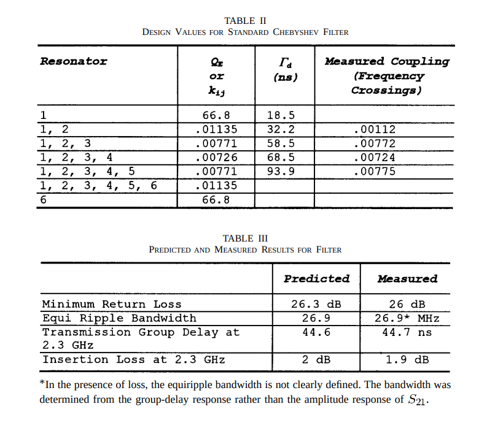

# rftune

Python 3 script for tuning, specifically narrow-band, bandpass filters.
The script requires the numpy and sympy library.

## Overview

The script has tables for low pass prototype filters, coupled
filters, and predistorted filters.  Use this script to predict
the properties of a filter you are designing.  It calculates
the insertion loss, the transmission delay, minimum
return loss, as well as the various Ness [1][2] group delays 
and associated return losses for the
given filter.

## Example

To predict the properties of a 6 pole Chebyshev filter of 0.01 dB ripple centered at 2.3 GHz
with a ripple bandwidth of 26.9 Mhz and an unloaded resonator Q of 1400, run the following.
(This filter is an example from Ness's paper. [1])


```
$ rftune -g --cheb .01 -n 6 -f 2.3e9 -b 26.9e6 -u 1400
---------------------------------------
       6 Pole Chebyshev 0.01 dB        
---------------------------------------
Design Bandwidth    =         26.9000 MHz
Center Frequency    =       2300.0000 MHz
Delay Bandwidth     =         30.5490 MHz
3dB Bandwidth       =         30.5600 MHz
Transmission Delay  =         44.6989 ns
Minimum Return Loss =         27.5983 dB
Insertion Loss      =          2.0144 dB
Unloaded QU         =       1400.0000
Filter Loaded QL    =         85.5019
Normalized Qo       =         16.3739
Normalized and Denormalized Qi and Kij
  q1      0.781350   |   Q1     66.806877
  k12     0.970077   |   K12     0.011346
  k23     0.659672   |   K23     0.007715
  k34     0.620929   |   K34     0.007262
  k45     0.659672   |   K45     0.007715
  k56     0.970073   |   K56     0.011346
  q6      0.781356   |   Q6     66.807423
Lossless Ness Group Delay and Return Loss
  1              18.492 ns   0.000 dB   |   6              18.492 ns   0.000 dB
  1 2            32.186 ns   0.000 dB   |   6 5            32.186 ns   0.000 dB
  1 2 3          58.480 ns   0.000 dB   |   6 5 4          58.480 ns   0.000 dB
  1 2 3 4        68.514 ns   0.000 dB   |   6 5 4 3        68.514 ns   0.000 dB
  1 2 3 4 5      93.909 ns   0.000 dB   |   6 5 4 3 2      93.909 ns   0.000 dB
  1 2 3 4 5 6    85.313 ns   0.000 dB   |   6 5 4 3 2 1    85.313 ns   0.000 dB
Ness Group Delay and Return Loss (QU=1400.0)
  1              18.534 ns   0.830 dB   |   6              18.534 ns   0.830 dB
  1 2            32.025 ns   1.440 dB   |   6 5            32.025 ns   1.440 dB
  1 2 3          58.789 ns   2.626 dB   |   6 5 4          58.789 ns   2.626 dB
  1 2 3 4        67.860 ns   3.062 dB   |   6 5 4 3        67.860 ns   3.062 dB
  1 2 3 4 5      94.893 ns   4.224 dB   |   6 5 4 3 2      94.894 ns   4.224 dB
  1 2 3 4 5 6    84.287 ns   3.809 dB   |   6 5 4 3 2 1    84.287 ns   3.809 dB
```


Delay Bandwidth is the bandwidth determined from the group-delay response
of S21, that is, the width of the group delay peaks in the S21 response.



If your VNA is 50 ohms but your filter terminates in 100 ohms, the script
will adjust its predictions for this.


```
$ rftune -g --cheb .01 -n 6 -f 2.3e9 -b 26.9e6 -u 1400 --re 100
---------------------------------------
       6 Pole Chebyshev 0.01 dB        
---------------------------------------
Design Bandwidth    =         26.9000 MHz
Center Frequency    =       2300.0000 MHz
Delay Bandwidth     =         30.5490 MHz
3dB Bandwidth       =         30.5600 MHz
Transmission Delay  =         44.6989 ns
Minimum Return Loss =         27.5983 dB
Insertion Loss      =          2.0144 dB
Unloaded QU         =       1400.0000
Filter Loaded QL    =         85.5019
Normalized Qo       =         16.3739
Normalized and Denormalized Qi and Kij
  q1      0.781350   |   Q1     66.806877
  k12     0.970077   |   K12     0.011346
  k23     0.659672   |   K23     0.007715
  k34     0.620929   |   K34     0.007262
  k45     0.659672   |   K45     0.007715
  k56     0.970073   |   K56     0.011346
  q6      0.781356   |   Q6     66.807423
Lossless Ness Group Delay and Return Loss
  1              18.492 ns   0.000 dB   |   6              18.492 ns   0.000 dB
  1 2            32.186 ns   0.000 dB   |   6 5            32.186 ns   0.000 dB
  1 2 3          58.480 ns   0.000 dB   |   6 5 4          58.480 ns   0.000 dB
  1 2 3 4        68.514 ns   0.000 dB   |   6 5 4 3        68.514 ns   0.000 dB
  1 2 3 4 5      93.909 ns   0.000 dB   |   6 5 4 3 2      93.909 ns   0.000 dB
  1 2 3 4 5 6    85.313 ns   0.000 dB   |   6 5 4 3 2 1    85.313 ns   0.000 dB
Ness Group Delay and Return Loss (QU=1400.0)
  1              18.534 ns   0.830 dB   |   6              18.534 ns   0.830 dB
  1 2            32.025 ns   1.440 dB   |   6 5            32.025 ns   1.440 dB
  1 2 3          58.789 ns   2.626 dB   |   6 5 4          58.789 ns   2.626 dB
  1 2 3 4        67.860 ns   3.062 dB   |   6 5 4 3        67.860 ns   3.062 dB
  1 2 3 4 5      94.893 ns   4.224 dB   |   6 5 4 3 2      94.894 ns   4.224 dB
  1 2 3 4 5 6    84.287 ns   3.809 dB   |   6 5 4 3 2 1    84.287 ns   3.809 dB
Filter Termination and Line Impedance Mismatch Results (QU=1400.0)
  1               9.251 ns   0.415 dB   |   6               9.251 ns   0.415 dB
  1 2            65.403 ns   2.901 dB   |   6 5            65.403 ns   2.901 dB
  1 2 3          28.896 ns   1.306 dB   |   6 5 4          28.896 ns   1.306 dB
  1 2 3 4       149.828 ns   6.326 dB   |   6 5 4 3       149.828 ns   6.326 dB
  1 2 3 4 5      45.394 ns   2.081 dB   |   6 5 4 3 2      45.394 ns   2.081 dB
  1 2 3 4 5 6   197.528 ns   8.025 dB   |   6 5 4 3 2 1   197.527 ns   8.025 dB
  Line Impedance                   50.0000 ohm
  Termination Resistance          100.0000 ohm
  Transmission Delay               39.2184 ns
  Insertion Loss                    3.4027 dB
  Empirical QE1                    33.4034
  Empirical QE6                    33.4037
```


# Usage


```
$ rftune -h
usage: rftune [-h] [-l] [-p] [-g] [-u QU] [-n NUMBER] [-f FREQUENCY]
              [-b BANDWIDTH] [--zo ZO] [--re RE] [--butterworth] [--bessel]
              [--legendre] [--chebyshev CHEBYSHEV] [--gaussian GAUSSIAN]
              [--linear-phase LINEAR_PHASE] [--validate]

optional arguments:
  -h, --help            show this help message and exit
  -l, --list
  -p, --predistorted    use Zverev's predistorted filters (default: False)
  -g, --g               use lowpass prototype table (default: False)
  -u QU, --qu QU        unloaded quality factor (default: inf)
  -n NUMBER, --number NUMBER
                        number of filter poles (default: None)
  -f FREQUENCY, --frequency FREQUENCY
                        center frequency (default: None)
  -b BANDWIDTH, --bandwidth BANDWIDTH
                        bandwidth (default: None)
  --zo ZO               line impedance (default: 50.0)
  --re RE               filter impedance (default: 50.0)
  --butterworth
  --bessel
  --legendre
  --chebyshev CHEBYSHEV
  --gaussian GAUSSIAN
  --linear-phase LINEAR_PHASE
  --validate
```


## Tables

The following lowpass prototype filter coefficients are supported.
Note the bandwidth for these lowpass prototype Chebyshev filters is the ripple bandwidth.
The bandwidth for the coupled Chebyshev filters below are 3dB bandwidth.


```
$ rftune -g --list
Butterworth
Chebyshev 0.01 dB
Chebyshev 0.1 dB
Chebyshev 0.25 dB
Chebyshev 0.5 dB
Chebyshev 1.0 dB
Bessel
Linear Phase 0.05 Deg
Linear Phase 0.5 Deg
Legendre
Gaussian 6 dB
Gaussian 12 dB
```


The following coupled filter coefficients are supported.


```
$ rftune --list
Butterworth
Chebyshev 0.01 dB
Chebyshev 0.1 dB
Chebyshev 0.5 dB
Chebyshev 1.0 dB
Bessel
Linear Phase 0.05 Deg
Linear Phase 0.5 Deg
Gaussian 6 dB
Gaussian 12 dB
```


The following predistorted coupled filter coefficients from Zverev [3] are supported.


```
$ rftune -p --list
Butterworth
Chebyshev 0.01 dB
Chebyshev 0.1 dB
Chebyshev 0.5 dB
Bessel
Linear Phase 0.05 Deg
Linear Phase 0.5 Deg
Gaussian
Gaussian 6 dB
Gaussian 12 dB
Legendre
```


## Footnotes

[1] "A Unified Approach to the Design, Measurement, and Tuning 
of Coupled-Resonator Filter", John B. Ness, IEEE MTT Vol 46, No 4, April 1998

[2] See "Microwave Filters for Communication Systems: Fundamental Application",
Cameron, Mansour, Kaudsia, pp 610-615.   Also "Modern RF and Microwave
Filter Design", Pramanick, Bhartia, pp 346-349.

[3] "Handbook of Filter Synthesis", Anatol I. Zverev, 1967


